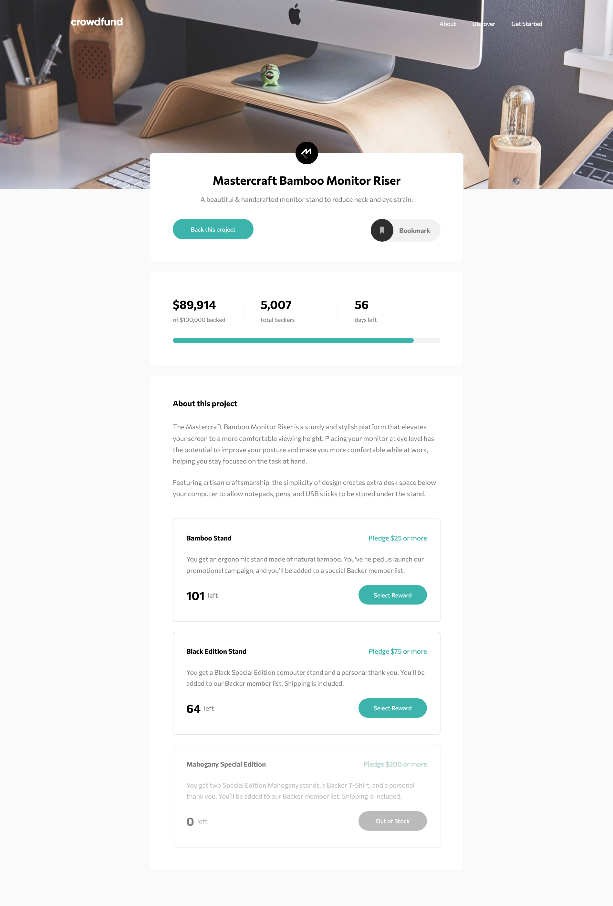

# Frontend Mentor - Crowdfunding product page solution

This is a solution to the [Crowdfunding product page challenge on Frontend Mentor](https://www.frontendmentor.io/challenges/crowdfunding-product-page-7uvcZe7ZR). Frontend Mentor challenges help you improve your coding skills by building realistic projects. 

### The challenge

Users should be able to:

- View the optimal layout depending on their device's screen size
- See hover states for interactive elements
- Make a selection of which pledge to make
- See an updated progress bar and total money raised based on their pledge total after confirming a pledge
- See the number of total backers increment by one after confirming a pledge
- Toggle whether or not the product is bookmarked

### Links

-  [Solution](https://www.frontendmentor.io/solutions/crowdfunding-product-page-JkPipzF5y-)
-  [Live Site](https://lspacka.github.io/FEM-crowdfunding-product-page/)

### Built with

- HTML5
- CSS
- JavaScript
- GSAP

## Author

- [Frontend Mentor](https://www.frontendmentor.io/profile/lspacka)